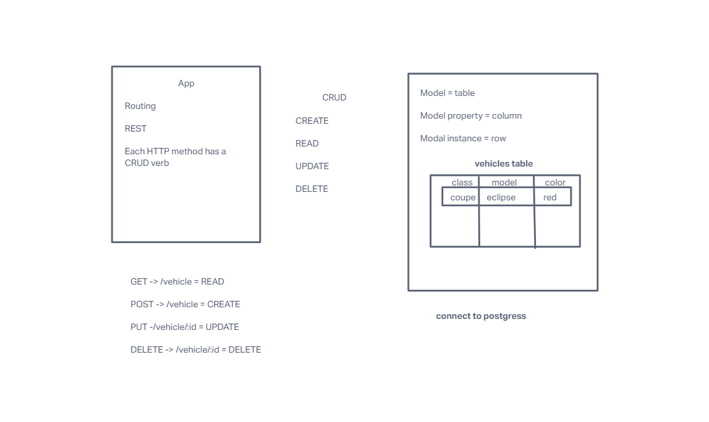

# basic-api-server

A useless HTTP server for demonstration purposes.

## Deployed links:

- [Heroku Link](https://basic-api-server-bc.herokuapp.com/vehicles)

## UML

## Installation

- Clone from this repo `git clone https://github.com/bradyjcamp/basic-express-server.git`
- cd into basic-api-server
- `npm install`
  - dotenv
  - express
  - nodemon
  - jest
  - supertest

## Usage

Once installed, run `npm start`

## Contributors / Authors

- Brady Camp
- JS 401 d46 class.

## Features / Routes

- GET : `/vehicles`
- GET : `/vehicles/:id`
- POST : `/vehicles/:id`
- DELETE : `/vehicles/:id`
- PUT: `/vehicles`
  - Parameters
    - must include a query parameter of name.
  - Response
    - status 200, and string body if parameters look good.
    - status 404, if incorrect route.
    - status 500, if query parameters incorrect
